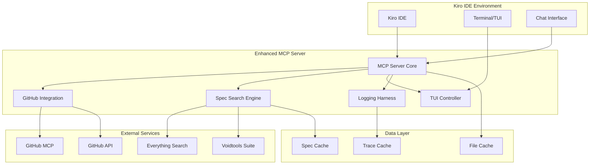
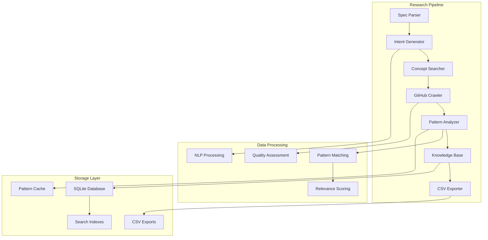

# Enhanced Everything MCP Server Design

## Overview

The Enhanced Everything MCP Server transforms the existing file search tool into a comprehensive spec-driven development platform that integrates deeply with Kiro IDE's workflow. The design builds upon the current MCP architecture while adding GitHub integration, a Terminal User Interface (TUI), advanced specification-driven tools, and enhanced logging capabilities.

## Architecture

### High-Level Architecture



### Component Architecture

The enhanced server follows a modular architecture with clear separation of concerns:

1. **MCP Server Core**: Handles MCP protocol communication and tool routing
2. **GitHub Integration Layer**: Manages GitHub MCP communication and API calls
3. **Spec Search Engine**: Provides specification-aware search capabilities
4. **TUI Controller**: Manages terminal user interface interactions
5. **Logging Harness**: Comprehensive logging and debugging system
6. **Cache Layer**: Performance optimization through intelligent caching

## Components and Interfaces

### 1. Enhanced MCP Server Core

**Purpose**: Extended version of the current MCP server with additional capabilities

**Key Interfaces**:
```typescript
interface EnhancedMCPServer extends MCPServer {
  // GitHub integration
  githubIntegration: GitHubIntegration;
  
  // Spec-driven tools
  specSearchEngine: SpecSearchEngine;
  
  // TUI management
  tuiController: TUIController;
  
  // Enhanced logging
  loggingHarness: LoggingHarness;
  
  // Installation utilities
  installationManager: InstallationManager;
}
```

**New Tools**:
- `everything_search_specs`: Specification-aware search
- `everything_github_search`: Combined local/GitHub search
- `everything_deep_research`: Intent-based code research across public repos
- `everything_build_knowledge`: Build and query SQLite knowledge base
- `everything_export_csv`: Export search results to CSV using ES tools
- `everything_suggest_implementation`: Generate implementation suggestions from specs
- `everything_discover_concepts`: Find adjacent concepts and patterns
- `everything_project_summary`: Project overview generation
- `everything_spec_report`: Specification status reporting
- `everything_tui_launch`: Launch TUI interface
- `everything_install_kiro`: One-click Kiro installation

### 2. GitHub Integration Layer

**Purpose**: Seamless integration with GitHub MCP server and GitHub API

**Key Interfaces**:
```typescript
interface GitHubIntegration {
  // MCP integration
  connectToGitHubMCP(): Promise<boolean>;
  searchRepositories(query: string, options: SearchOptions): Promise<GitHubSearchResult[]>;
  
  // Direct API integration
  getRepositoryInfo(repo: string): Promise<RepositoryInfo>;
  getFileHistory(repo: string, path: string): Promise<FileHistory>;
  searchCode(query: string, repo?: string): Promise<CodeSearchResult[]>;
  
  // Combined operations
  searchLocalAndRemote(query: string): Promise<CombinedSearchResult>;
}

interface CombinedSearchResult {
  local: SearchResult[];
  github: GitHubSearchResult[];
  crossReferences: CrossReference[];
}
```

**Features**:
- Automatic GitHub MCP detection and connection
- Fallback to direct GitHub API if MCP unavailable
- Cross-referencing between local and remote files
- Repository metadata integration
- Commit history and PR status for files

### 3. Intelligent Research Search Engine

**Purpose**: Advanced search capabilities with deep code research, intent-based discovery, and knowledge base building

**Key Interfaces**:
```typescript
interface IntelligentSearchEngine {
  // Spec-aware search
  searchSpecifications(query: string, options: SpecSearchOptions): Promise<SpecSearchResult[]>;
  
  // Deep research capabilities
  performDeepCodeResearch(spec: SpecificationDocument): Promise<DeepResearchResult>;
  searchByIntent(intent: IntentQuery): Promise<IntentSearchResult[]>;
  discoverAdjacentConcepts(concept: string): Promise<ConceptMap>;
  
  // Knowledge base management
  buildLibraryIndex(repositories: Repository[]): Promise<LibraryIndex>;
  queryKnowledgeBase(query: KnowledgeQuery): Promise<KnowledgeResult[]>;
  updateKnowledgeBase(newFindings: ResearchFindings): Promise<void>;
  
  // Export and analysis
  exportToCsv(results: SearchResult[], format: CsvFormat): Promise<string>;
  generateImplementationSuggestions(spec: SpecificationDocument): Promise<ImplementationSuggestion[]>;
  
  // Project analysis
  analyzeProjectStructure(): Promise<ProjectStructure>;
  generateProjectSummary(): Promise<ProjectSummary>;
  
  // Traceability
  findRequirementTraces(requirementId: string): Promise<TraceabilityResult>;
  validateSpecificationCoverage(): Promise<CoverageReport>;
}

interface SpecSearchResult extends SearchResult {
  documentType: 'requirements' | 'design' | 'tasks' | 'implementation' | 'test';
  specificationId?: string;
  requirementReferences: string[];
  completionStatus: 'not_started' | 'in_progress' | 'completed';
  lastModified: Date;
  relatedFiles: string[];
}
```

**Deep Research Features**:
- **Intent-Based Search**: Analyze specification goals and search for matching code patterns
- **Concept Discovery**: Find adjacent concepts and related implementation approaches
- **Pattern Recognition**: Identify common patterns that match specification requirements
- **Knowledge Base Building**: Accumulate findings in SQLite database over time
- **CSV Export Integration**: Leverage ES tools for structured data export
- **Implementation Suggestions**: Generate code suggestions based on research findings

**Traditional Features**:
- Document type classification (requirements, design, tasks, etc.)
- Specification metadata extraction
- Requirement traceability analysis
- Cross-reference detection between specs and implementation
- Completion status tracking

**Deep Research Interfaces**:
```typescript
interface DeepResearchResult {
  query: IntentQuery;
  repositories: RepositoryMatch[];
  codePatterns: CodePattern[];
  implementationApproaches: ImplementationApproach[];
  relatedConcepts: ConceptMap;
  confidenceScore: number;
  exportPath?: string; // CSV export location
}

interface IntentQuery {
  specification: SpecificationDocument;
  goals: string[];
  constraints: string[];
  preferredLanguages: string[];
  architecturalPatterns: string[];
  searchDepth: 'shallow' | 'medium' | 'deep';
}

interface RepositoryMatch {
  repository: string;
  relevanceScore: number;
  matchingFiles: FileMatch[];
  implementationQuality: QualityMetrics;
  licenseCompatibility: boolean;
  lastActivity: Date;
  stars: number;
  forks: number;
}

interface CodePattern {
  pattern: string;
  description: string;
  examples: CodeExample[];
  frequency: number;
  repositories: string[];
  applicability: ApplicabilityScore;
}

interface KnowledgeBase {
  // SQLite schema
  repositories: Repository[];
  codePatterns: CodePattern[];
  concepts: Concept[];
  implementations: Implementation[];
  relationships: Relationship[];
  
  // Query interface
  query(sql: string): Promise<any[]>;
  addFindings(findings: ResearchFindings): Promise<void>;
  buildIndex(field: string): Promise<void>;
  exportCsv(table: string, filters?: any): Promise<string>;
}
```

### 4. Terminal User Interface (TUI)

**Purpose**: Rich terminal interface for interactive search and project management

**Key Interfaces**:
```typescript
interface TUIController {
  // TUI lifecycle
  launch(): Promise<void>;
  shutdown(): Promise<void>;
  
  // Screen management
  showDashboard(): void;
  showSearchInterface(): void;
  showSpecificationReport(): void;
  showProjectSummary(): void;
  
  // User interaction
  handleKeyboardInput(key: string): void;
  updateDisplay(data: any): void;
}
```

**TUI Screens**:

1. **Dashboard Screen**:
   - Project overview with key metrics
   - Recent search history
   - Specification status summary
   - Quick action buttons

2. **Search Interface**:
   - Real-time search with live filtering
   - Multiple search modes (local, GitHub, combined)
   - Result categorization and sorting
   - File preview capabilities

3. **Specification Report**:
   - Requirements coverage matrix
   - Task completion progress
   - Traceability visualization
   - Gap analysis

4. **Project Summary**:
   - File type distribution
   - Recent activity timeline
   - Contributor statistics
   - Code quality metrics

5. **Deep Research Interface**:
   - Intent-based search configuration
   - Research progress monitoring
   - Pattern discovery visualization
   - Knowledge base query interface

6. **Implementation Suggestions**:
   - AI-generated implementation recommendations
   - Code pattern library browser
   - Quality-scored alternatives
   - License compatibility matrix

**TUI Framework**: Built using `blessed` or `ink` for rich terminal interfaces with:
- Keyboard navigation
- Mouse support
- Responsive layouts
- Color themes
- Progress indicators

### 5. Logging Harness

**Purpose**: Comprehensive logging, debugging, and testing framework

**Key Interfaces**:
```typescript
interface LoggingHarness {
  // Structured logging
  logOperation(operation: string, data: any, level: LogLevel): Promise<void>;
  logError(error: Error, context: any): Promise<void>;
  logPerformance(operation: string, duration: number, metadata: any): Promise<void>;
  
  // Testing framework
  runHelloWorldTest(): Promise<TestResult>;
  runIntegrationTests(): Promise<TestResult[]>;
  validateConfiguration(): Promise<ValidationResult>;
  
  // Debug utilities
  captureSystemState(): Promise<SystemState>;
  generateDebugReport(): Promise<DebugReport>;
}
```

**Logging Features**:
- Structured JSON logging with correlation IDs
- Performance metrics collection
- Error tracking with stack traces
- Operation tracing for debugging
- Log aggregation and analysis

**Testing Framework**:
- Hello World test covering all major functionality
- Integration tests for GitHub MCP connection
- Everything service validation
- TUI component testing
- Configuration validation

### 6. Installation Manager

**Purpose**: One-click installation and configuration for Kiro IDE

**Key Interfaces**:
```typescript
interface InstallationManager {
  // Installation
  installForKiro(): Promise<InstallationResult>;
  detectKiroConfiguration(): Promise<KiroConfig>;
  generateMCPConfiguration(): Promise<MCPConfig>;
  
  // Validation
  validateDependencies(): Promise<DependencyCheck>;
  verifyInstallation(): Promise<VerificationResult>;
  
  // Updates
  checkForUpdates(): Promise<UpdateInfo>;
  performUpdate(): Promise<UpdateResult>;
}
```

## Deep Research Architecture

### Intent-Based Search Pipeline



### Research Workflow

1. **Specification Analysis**: Parse requirements and design documents to extract goals, constraints, and technical requirements
2. **Intent Generation**: Convert specification goals into searchable intent queries with related concepts
3. **Concept Discovery**: Use NLP to find adjacent concepts and alternative approaches
4. **Repository Search**: Search GitHub using multiple strategies (keyword, topic, code search)
5. **Pattern Analysis**: Analyze found code for patterns that match specification requirements
6. **Quality Assessment**: Evaluate code quality, license compatibility, and maintenance status
7. **Knowledge Storage**: Store findings in SQLite database with full-text search capabilities
8. **CSV Export**: Export structured data using ES tools for further analysis
9. **Implementation Suggestions**: Generate actionable implementation recommendations

### SQLite Knowledge Base Schema

```sql
-- Repositories table
CREATE TABLE repositories (
    id INTEGER PRIMARY KEY,
    full_name TEXT UNIQUE,
    description TEXT,
    language TEXT,
    stars INTEGER,
    forks INTEGER,
    license TEXT,
    last_activity DATE,
    quality_score REAL,
    created_at TIMESTAMP DEFAULT CURRENT_TIMESTAMP
);

-- Code patterns table
CREATE TABLE code_patterns (
    id INTEGER PRIMARY KEY,
    pattern_hash TEXT UNIQUE,
    pattern_type TEXT,
    description TEXT,
    code_snippet TEXT,
    language TEXT,
    frequency INTEGER DEFAULT 1,
    confidence_score REAL,
    created_at TIMESTAMP DEFAULT CURRENT_TIMESTAMP
);

-- Concepts and relationships
CREATE TABLE concepts (
    id INTEGER PRIMARY KEY,
    name TEXT UNIQUE,
    description TEXT,
    category TEXT,
    related_terms TEXT, -- JSON array
    created_at TIMESTAMP DEFAULT CURRENT_TIMESTAMP
);

-- Implementation approaches
CREATE TABLE implementations (
    id INTEGER PRIMARY KEY,
    repository_id INTEGER,
    pattern_id INTEGER,
    file_path TEXT,
    approach_description TEXT,
    complexity_score REAL,
    maintainability_score REAL,
    FOREIGN KEY (repository_id) REFERENCES repositories(id),
    FOREIGN KEY (pattern_id) REFERENCES code_patterns(id)
);

-- Research sessions
CREATE TABLE research_sessions (
    id INTEGER PRIMARY KEY,
    specification_hash TEXT,
    intent_query TEXT,
    results_count INTEGER,
    execution_time REAL,
    created_at TIMESTAMP DEFAULT CURRENT_TIMESTAMP
);

-- Full-text search indexes
CREATE VIRTUAL TABLE repositories_fts USING fts5(
    full_name, description, content='repositories', content_rowid='id'
);

CREATE VIRTUAL TABLE patterns_fts USING fts5(
    description, code_snippet, content='code_patterns', content_rowid='id'
);
```

## Data Models

### Enhanced Search Result
```typescript
interface EnhancedSearchResult {
  // Base search result
  path: string;
  name: string;
  size?: number;
  modified?: string;
  type: 'file' | 'folder';
  
  // GitHub integration
  githubInfo?: {
    repository: string;
    branch: string;
    commitHash: string;
    lastCommitMessage: string;
    pullRequestStatus?: string;
    issueReferences: string[];
  };
  
  // Specification context
  specContext?: {
    documentType: DocumentType;
    specificationId: string;
    requirementReferences: string[];
    implementationStatus: ImplementationStatus;
    relatedFiles: string[];
    lastReviewDate?: Date;
  };
  
  // Performance metadata
  searchMetadata: {
    searchTime: number;
    cacheHit: boolean;
    relevanceScore: number;
  };
}
```

### Project Structure Model
```typescript
interface ProjectStructure {
  rootPath: string;
  specificationFiles: SpecificationFile[];
  implementationFiles: ImplementationFile[];
  testFiles: TestFile[];
  documentationFiles: DocumentationFile[];
  
  // Relationships
  traceabilityMatrix: TraceabilityMatrix;
  dependencyGraph: DependencyGraph;
  
  // Metrics
  metrics: {
    totalFiles: number;
    specificationCoverage: number;
    testCoverage: number;
    lastAnalyzed: Date;
  };
}
```

## Error Handling

### Error Categories
1. **Everything Service Errors**: Handle es.exe unavailability, permission issues
2. **GitHub Integration Errors**: API rate limits, authentication failures, network issues
3. **TUI Errors**: Terminal compatibility, rendering issues, input handling
4. **Configuration Errors**: Invalid settings, missing dependencies
5. **Performance Errors**: Memory limits, timeout issues, cache failures

### Error Recovery Strategies
- **Graceful Degradation**: Fall back to basic functionality when advanced features fail
- **Retry Logic**: Automatic retry with exponential backoff for transient failures
- **User Notification**: Clear error messages with actionable recovery steps
- **Logging**: Comprehensive error logging for debugging and monitoring

## Testing Strategy

### Test Categories

1. **Unit Tests**:
   - Individual tool functionality
   - Data model validation
   - Utility function testing
   - Error handling verification

2. **Integration Tests**:
   - MCP protocol communication
   - GitHub MCP integration
   - Everything service integration
   - TUI component interaction

3. **End-to-End Tests**:
   - Complete workflow testing
   - Kiro IDE integration
   - Performance benchmarking
   - User scenario validation

4. **Hello World Test Suite**:
   ```typescript
   interface HelloWorldTest {
     testEverythingConnection(): Promise<TestResult>;
     testGitHubIntegration(): Promise<TestResult>;
     testTUILaunch(): Promise<TestResult>;
     testSpecificationSearch(): Promise<TestResult>;
     testLoggingHarness(): Promise<TestResult>;
     runFullWorkflow(): Promise<TestResult>;
   }
   ```

### Performance Testing
- Search performance benchmarks
- Memory usage monitoring
- TUI responsiveness testing
- Cache effectiveness measurement
- GitHub API rate limit handling

### Compatibility Testing
- Windows version compatibility
- Node.js version testing
- Kiro IDE version compatibility
- Terminal emulator testing

## Security Considerations

1. **GitHub Authentication**: Secure token handling and storage
2. **File System Access**: Proper permission validation and sandboxing
3. **Command Execution**: Safe execution of es.exe with input validation
4. **Network Security**: HTTPS enforcement for GitHub API calls
5. **Logging Security**: Sanitization of sensitive data in logs

## Performance Optimization

1. **Caching Strategy**:
   - Search result caching with TTL
   - GitHub API response caching
   - Specification metadata caching
   - File system metadata caching

2. **Lazy Loading**:
   - TUI component lazy initialization
   - GitHub integration on-demand loading
   - Large result set pagination

3. **Background Processing**:
   - Asynchronous logging
   - Background cache warming
   - Periodic specification analysis

4. **Resource Management**:
   - Memory usage monitoring
   - Connection pooling for GitHub API
   - Efficient data structures for large result sets