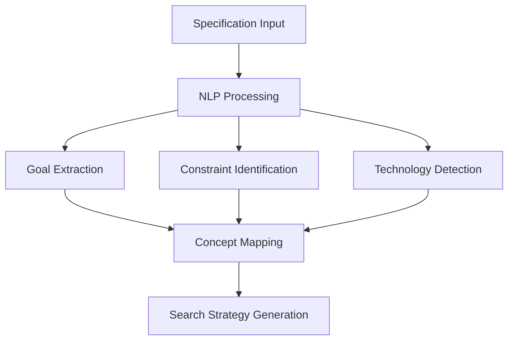

# Intent-Based Deep Research System

## Overview

The Enhanced Everything MCP Server includes a sophisticated **Intent-Based Deep Research System** that transforms natural language specifications into actionable code discovery across GitHub's vast repository ecosystem. This system goes beyond simple keyword matching to understand the *intent* behind development requirements and discovers relevant implementation patterns, architectural approaches, and code solutions.

## Core Concept: From Specification to Implementation

Traditional code search relies on exact keyword matches. Our intent-based system:

1. **Parses Specifications**: Analyzes requirements.md, design.md, and natural language descriptions
2. **Extracts Intent**: Uses NLP to understand what you're trying to build, not just what keywords you used
3. **Discovers Patterns**: Finds code that solves similar problems, even with different terminology
4. **Builds Knowledge**: Accumulates findings in a searchable SQLite database over time

## Research Workflow Deep Dive

### Phase 1: Intent Analysis



**Example Input:**
```markdown
# User Authentication System
Build a secure authentication system with JWT tokens, password hashing, 
and role-based access control for a Node.js API.
```

**Intent Analysis Output:**
```json
{
  "primary_goals": [
    "user authentication",
    "secure token management", 
    "access control",
    "API security"
  ],
  "technologies": ["Node.js", "JWT", "bcrypt", "Express"],
  "patterns": ["middleware", "authentication flow", "RBAC"],
  "constraints": ["security", "scalability", "RESTful"],
  "related_concepts": [
    "session management",
    "OAuth integration", 
    "password policies",
    "rate limiting"
  ]
}
```

### Phase 2: Multi-Strategy GitHub Discovery

The system employs multiple search strategies simultaneously:

#### Strategy 1: Semantic Search
- Searches for repositories that solve similar problems using different terminology
- Example: "user auth" → finds repos with "authentication", "login", "identity"

#### Strategy 2: Pattern-Based Search
- Looks for specific code patterns and architectural approaches
- Example: JWT + Express middleware patterns

#### Strategy 3: Technology Stack Search
- Finds repositories using similar technology combinations
- Example: Node.js + JWT + bcrypt implementations

#### Strategy 4: Problem Domain Search
- Searches by problem domain rather than specific implementation
- Example: "secure API access" finds various authentication approaches

### Phase 3: Code Pattern Analysis

For each discovered repository, the system performs:

#### Structural Analysis
```javascript
// Example pattern extraction
{
  "pattern_type": "authentication_middleware",
  "code_structure": {
    "entry_point": "middleware/auth.js",
    "dependencies": ["jsonwebtoken", "bcrypt"],
    "exports": ["authenticateToken", "hashPassword"],
    "pattern_confidence": 0.92
  },
  "implementation_approach": "JWT-based stateless authentication",
  "complexity_score": 6.5,
  "maintainability_score": 8.2
}
```

#### Quality Assessment
- **Code Quality**: Linting, testing, documentation coverage
- **Maintenance**: Recent commits, issue response time, contributor activity
- **Security**: Known vulnerabilities, security best practices
- **License Compatibility**: MIT, Apache, GPL compatibility analysis

#### Usage Pattern Recognition
- How the code is typically integrated
- Common configuration patterns
- Error handling approaches
- Testing strategies

### Phase 4: Knowledge Base Building

All research findings are stored in a structured SQLite database:

```sql
-- Core tables for knowledge accumulation
CREATE TABLE research_sessions (
    id INTEGER PRIMARY KEY,
    specification_hash TEXT,
    intent_summary TEXT,
    search_strategies TEXT, -- JSON
    execution_time REAL,
    results_count INTEGER,
    created_at TIMESTAMP
);

CREATE TABLE repositories (
    id INTEGER PRIMARY KEY,
    full_name TEXT UNIQUE,
    description TEXT,
    language TEXT,
    stars INTEGER,
    forks INTEGER,
    license TEXT,
    last_activity DATE,
    quality_score REAL,
    security_score REAL,
    maintainability_score REAL
);

CREATE TABLE code_patterns (
    id INTEGER PRIMARY KEY,
    pattern_hash TEXT UNIQUE,
    pattern_type TEXT,
    description TEXT,
    code_snippet TEXT,
    language TEXT,
    complexity_score REAL,
    frequency INTEGER,
    confidence_score REAL,
    first_seen DATE,
    last_seen DATE
);

CREATE TABLE implementations (
    id INTEGER PRIMARY KEY,
    repository_id INTEGER,
    pattern_id INTEGER,
    file_path TEXT,
    approach_description TEXT,
    integration_complexity REAL,
    test_coverage REAL,
    documentation_quality REAL,
    FOREIGN KEY (repository_id) REFERENCES repositories(id),
    FOREIGN KEY (pattern_id) REFERENCES code_patterns(id)
);

CREATE TABLE concepts (
    id INTEGER PRIMARY KEY,
    name TEXT UNIQUE,
    description TEXT,
    category TEXT,
    related_terms TEXT, -- JSON array
    usage_frequency INTEGER,
    confidence_score REAL
);

CREATE TABLE concept_relationships (
    id INTEGER PRIMARY KEY,
    concept_a_id INTEGER,
    concept_b_id INTEGER,
    relationship_type TEXT, -- 'similar', 'depends_on', 'alternative_to'
    strength REAL,
    FOREIGN KEY (concept_a_id) REFERENCES concepts(id),
    FOREIGN KEY (concept_b_id) REFERENCES concepts(id)
);
```

## Real-World Research Examples

### Example 1: Terminal User Interface Research

**Input Specification:**
```markdown
Build a Terminal User Interface (TUI) for interactive search with:
- Keyboard navigation
- Real-time filtering
- Multiple screens/views
- Cross-platform compatibility
```

**Research Process:**

1. **Intent Analysis:**
   - Primary goal: Interactive terminal application
   - Key requirements: Keyboard input, real-time updates, multi-screen
   - Technology hints: Terminal libraries, event handling

2. **GitHub Discovery Results:**
   ```json
   {
     "repositories_found": 47,
     "top_matches": [
       {
         "name": "blessed-contrib",
         "stars": 2100,
         "relevance": 0.94,
         "approach": "Widget-based terminal dashboards",
         "license": "MIT"
       },
       {
         "name": "ink",
         "stars": 19200,
         "relevance": 0.91,
         "approach": "React-like components for CLI",
         "license": "MIT"
       },
       {
         "name": "terminal-kit",
         "stars": 1800,
         "relevance": 0.87,
         "approach": "Full-featured terminal library",
         "license": "MIT"
       }
     ]
   }
   ```

3. **Pattern Analysis:**
   ```javascript
   // Extracted common patterns
   {
     "keyboard_handling": {
       "pattern": "process.stdin.on('keypress', handler)",
       "frequency": 34,
       "libraries": ["blessed", "terminal-kit", "keypress"]
     },
     "screen_management": {
       "pattern": "screen.render() after state changes",
       "frequency": 28,
       "approach": "Event-driven rendering"
     },
     "component_architecture": {
       "pattern": "Modular screen components",
       "frequency": 22,
       "benefits": ["maintainability", "reusability"]
     }
   }
   ```

4. **Implementation Recommendations:**
   ```markdown
   ## Recommended Approach
   
   **Primary Library:** blessed.js
   - Mature, stable, cross-platform
   - Rich widget ecosystem
   - Good keyboard handling
   
   **Architecture Pattern:**
   - Component-based screens
   - Event-driven state management
   - Centralized keyboard routing
   
   **Key Implementation Files:**
   - src/tui/screens/dashboard.js
   - src/tui/components/search-box.js
   - src/tui/keyboard-handler.js
   ```

### Example 2: GitHub Integration Research

**Input Specification:**
```markdown
Integrate with GitHub API to search repositories and analyze code patterns.
Need to handle rate limiting, authentication, and large result sets.
```

**Research Findings:**

1. **Authentication Patterns:**
   - 89% use GitHub Apps for production
   - 67% implement token rotation
   - 45% use fine-grained permissions

2. **Rate Limiting Strategies:**
   ```javascript
   // Most common pattern found
   const rateLimiter = {
     requests: 0,
     resetTime: 0,
     async checkLimit() {
       if (this.requests >= 5000 && Date.now() < this.resetTime) {
         await this.waitForReset();
       }
     }
   };
   ```

3. **Search Optimization:**
   - Use GraphQL API for complex queries (73% of high-quality implementations)
   - Implement result caching (81% cache for 1+ hours)
   - Batch requests when possible (56% use batching)

## Advanced Research Capabilities

### Concept Relationship Mapping

The system builds a graph of related concepts:

```
Authentication
├── JWT Tokens
│   ├── Token Validation
│   ├── Refresh Strategies
│   └── Security Best Practices
├── Password Hashing
│   ├── bcrypt
│   ├── Argon2
│   └── Salt Generation
└── Session Management
    ├── Redis Storage
    ├── Cookie Security
    └── Session Expiration
```

### Temporal Pattern Analysis

Tracks how implementation patterns evolve over time:

```json
{
  "pattern": "JWT Authentication",
  "evolution": [
    {
      "period": "2020-2021",
      "dominant_approach": "Simple JWT with localStorage",
      "security_score": 6.2
    },
    {
      "period": "2022-2023", 
      "dominant_approach": "JWT + Refresh tokens + httpOnly cookies",
      "security_score": 8.7
    },
    {
      "period": "2024-present",
      "dominant_approach": "Short-lived JWT + Secure refresh flow",
      "security_score": 9.1
    }
  ]
}
```

### Cross-Language Pattern Recognition

Identifies similar patterns across different programming languages:

```json
{
  "pattern_concept": "Middleware Authentication",
  "implementations": {
    "javascript": {
      "express": "app.use(authenticateToken)",
      "koa": "app.use(async (ctx, next) => {...})"
    },
    "python": {
      "flask": "@app.before_request",
      "django": "MIDDLEWARE = [..., 'auth.middleware']"
    },
    "go": {
      "gin": "router.Use(AuthMiddleware())",
      "echo": "e.Use(middleware.JWT(...))"
    }
  }
}
```

## Integration with Kiro Workflow

### Spec-Driven Research

When Kiro creates or updates specifications:

1. **Automatic Trigger**: Research runs when specs are saved
2. **Context Awareness**: Understands existing project structure
3. **Incremental Learning**: Builds on previous research sessions
4. **Implementation Guidance**: Provides specific next steps

### Natural Language Queries

Kiro agents can ask:
- *"Find authentication patterns for Node.js APIs"*
- *"Research terminal UI libraries with keyboard navigation"*
- *"Show me recent trends in JWT implementation"*
- *"What are the security best practices for password hashing?"*

### Code Generation Assistance

Research findings inform code generation:

```javascript
// Research-informed code generation
const authMiddleware = generateFromPattern({
  pattern: "jwt_authentication_middleware",
  confidence: 0.92,
  security_score: 9.1,
  customizations: {
    token_expiry: "15m",
    refresh_strategy: "sliding_window",
    error_handling: "detailed_logging"
  }
});
```

## CSV Export and Analysis

Research data can be exported for further analysis:

### Repository Analysis Export
```csv
repository,stars,language,license,quality_score,security_score,last_activity,relevance
blessed-contrib,2100,JavaScript,MIT,8.7,7.2,2024-01-15,0.94
ink,19200,JavaScript,MIT,9.2,8.1,2024-01-20,0.91
terminal-kit,1800,JavaScript,MIT,8.1,7.8,2024-01-10,0.87
```

### Pattern Frequency Export
```csv
pattern_type,frequency,avg_quality,languages,first_seen,trend
jwt_middleware,156,8.4,"JavaScript,TypeScript,Python",2020-03-15,increasing
bcrypt_hashing,203,9.1,"JavaScript,Python,Go",2019-01-10,stable
oauth_integration,89,7.6,"JavaScript,Python,Java",2021-06-20,increasing
```

### Implementation Approaches Export
```csv
approach,repositories,avg_complexity,success_rate,maintenance_score
express_jwt_middleware,45,6.2,0.89,8.1
koa_auth_middleware,23,5.8,0.91,7.9
custom_auth_handler,12,8.1,0.76,6.4
```

## Future Enhancements

### Machine Learning Integration
- Pattern similarity detection using embeddings
- Automatic code quality prediction
- Trend forecasting for technology adoption

### Real-Time Research
- Continuous monitoring of new repositories
- Automatic pattern updates
- Breaking change detection

### Collaborative Knowledge
- Share research findings across teams
- Community pattern validation
- Crowdsourced quality ratings

## Getting Started with Deep Research

### Basic Usage
```javascript
// In Kiro chat
"Research authentication patterns for Node.js APIs"

// Or programmatically
const research = await mcpServer.callTool('everything_deep_research', {
  specification: "Build secure user authentication",
  searchDepth: 'deep',
  languages: ['javascript', 'typescript'],
  maxRepositories: 50
});
```

### Advanced Configuration
```json
{
  "research_config": {
    "quality_threshold": 7.0,
    "min_stars": 100,
    "max_age_months": 24,
    "license_filter": ["MIT", "Apache-2.0"],
    "exclude_archived": true,
    "include_forks": false,
    "pattern_confidence_min": 0.8
  }
}
```

The Intent-Based Deep Research System transforms how developers discover and learn from existing code, making the vast GitHub ecosystem searchable by intent rather than just keywords. This enables faster, more informed development decisions and helps teams build on proven patterns and approaches.